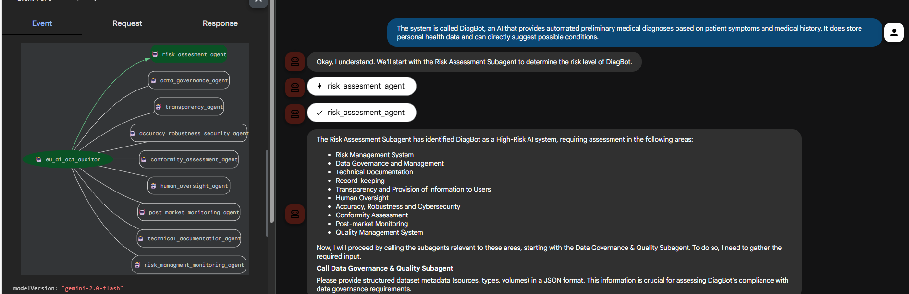

# Agentic Governance Fabric (AGF) - EU AI Act Auditor

A sophisticated multi-agent AI governance system designed to audit and ensure compliance of AI systems with the **EU AI Act**. This framework leverages specialized sub-agents to orchestrate comprehensive compliance assessments across multiple governance domains.

---

## 📋 Table of Contents

- [Overview](#overview)
- [Key Features](#key-features)
- [Project Structure](#project-structure)
- [Architecture](#architecture)
- [Getting Started](#getting-started)
- [System Components](#system-components)
- [Compliance Assessment Workflow](#compliance-assessment-workflow)
- [Requirements](#requirements)
- [Installation](#installation)
- [Usage](#usage)
- [Configuration](#configuration)
- [Contributing](#contributing)
- [License](#license)

---

## 🎯 Overview

The **Agentic Governance Fabric (AGF)** is an AI governance multi-agent model that automates compliance auditing for AI systems against the EU AI Act. It uses a hierarchical multi-agent architecture where:

- A **Root Orchestrator Agent** manages the overall audit workflow
- **Nine specialized Sub-Agents** conduct targeted compliance assessments
- Each sub-agent focuses on a specific governance domain (risk, data, transparency, security, etc.)
- Results are aggregated into comprehensive compliance reports

This system ensures AI systems deployed in EU jurisdictions meet rigorous regulatory requirements while maintaining transparency, accountability, and risk management standards.

---

## ✨ Key Features

### Multi-Domain Compliance Assessment
- **Risk Assessment**: Identifies and categorizes AI system risks
- **Data Governance**: Ensures data quality, lineage, and compliance
- **Transparency & Information**: Validates user-facing disclosure requirements
- **Human Oversight**: Verifies human-in-the-loop mechanisms
- **Accuracy & Robustness**: Tests model performance and resilience
- **Technical Documentation**: Reviews system design and architecture documentation
- **Risk Management & Monitoring**: Validates risk mitigation strategies
- **Conformity Assessment**: Confirms overall EU AI Act compliance
- **Post-Market Monitoring**: Tracks ongoing compliance post-deployment

### Intelligent Orchestration
- Sequential agent execution for traceability and accountability
- Conditional sub-agent invocation based on risk assessment findings
- Strict input validation and schema enforcement
- Automated audit trail with timestamps and evidence references

### Structured Output
- Standardized compliance reporting (Compliant/Partially Compliant/Non-Compliant)
- Detailed findings with explicit evidence references
- Prioritized remediation recommendations
- Deferred evidence tracking for incomplete assessments

---

## 🏗️ Project Structure

```
Agentic-Governance-Fabric-AGF-/
├── eu_ai_act_auditor/
│   ├── agent.py                    # Root orchestrator agent
│   ├── prompt.py                   # Orchestrator instructions and workflows
│   ├── __init__.py
│   ├── .env                        # Environment configuration
│   └── sub_agents/
│       ├── risk_assesor/           # Risk assessment sub-agent
│       ├── data_governor/          # Data governance sub-agent
│       ├── transparency_assesor/   # Transparency sub-agent
│       ├── accuracy_robustness_security/  # Security & accuracy sub-agent
│       ├── conformity_assessment/  # Conformity assessment sub-agent
│       ├── human_oversight/        # Human oversight sub-agent
│       ├── post_market_monitoring/ # Post-market monitoring sub-agent
│       ├── technical_documentation/# Documentation sub-agent
│       └── risk_management_monitoring/  # Risk management sub-agent
├── readme.md                       # This file
└── .gitattributes

```

---

## 🧠 Architecture

### Multi-Agent System Design

```
┌─────────────────────────────────────────┐
│   Root EU AI Act Auditor Agent          │
│   (Orchestrator - Gemini 2.0 Flash)    │
└────────────────┬────────────────────────┘
                 │
    ┌────────────┼────────────┬─────────────┬────────────┬─────────────┬───────────────┬──────────────┐
    │            │            │             │            │             │               │              │
    ▼            ▼            ▼             ▼            ▼             ▼               ▼              ▼
┌────────┐  ┌────────┐  ┌──────────┐  ┌────────┐  ┌──────────┐  ┌───────────┐  ┌──────────┐  ┌──────────────┐
│  Risk  │  │  Data  │  │Transparent│ │Human  │  │Accuracy  │  │Conformity │  │ Technical│  │Post-Market  │
│ Assess │  │ Govern │  │     &     │ │Oversight│ │Robustness│  │Assessment │  │Document  │  │Monitoring  │
│        │  │        │  │ Information│ │       │  │Security  │  │          │  │          │  │            │
└────────┘  └────────┘  └──────────┘  └────────┘  └──────────┘  └───────────┘  └──────────┘  └──────────────┘
     ▲           ▲            ▲             ▲            ▲             ▲               ▲              ▲
     └───────────┴────────────┴─────────────┴────────────┴─────────────┴───────────────┴──────────────┘
                          Conditional Invocation Based on Risk Profile
```

### Workflow Execution Model

1. **Initialization**: Root agent receives audit request
2. **Risk Assessment**: Mandatory first stage—identifies risk level and compliance areas
3. **Conditional Routing**: Based on risk output, determine which sub-agents to activate
4. **Sequential Execution**: Each sub-agent executes and validates findings
5. **Aggregation**: Compile results into final compliance report
6. **Output**: Standardized compliance assessment with remediation roadmap

---

## 🚀 Getting Started

### Prerequisites


1.  **Prerequisites**

    *   Python 3.11+
    *   Poetry
        *   For dependency management and packaging. Please follow the
            instructions on the official
            [Poetry website](https://python-poetry.org/docs/) for installation.

        ```bash
        pip install poetry
        ```

    * A project on Google Cloud Platform
    * Google Cloud CLI
        *   For installation, please follow the instruction on the official
            [Google Cloud website](https://cloud.google.com/sdk/docs/install).


### Installation

1. **Clone the repository:**
```bash
git clone https://github.com/ZaidSaid12/Agentic-Governance-Fabric-AGF-.git
cd Agentic-Governance-Fabric-AGF-
```

2. **Create a Python virtual environment:**
```bash
python -m venv venv
source venv/bin/activate  # On Windows: venv\Scripts\activate
```

3. **Install dependencies:**
```bash
poetry install
```

4. **Configure environment variables:**

```bash
cp .env.example .env
# Edit .env with your API keys and configuration
```

    *   Authenticate your GCloud account.

        ```bash
        gcloud auth application-default login
        gcloud auth application-default set-quota-project $GOOGLE_CLOUD_PROJECT
        ```

4. **Running the Agent:**
 

**Using `adk`**

Using the CLI:

```bash
poetry run adk run llm_auditor
```

Or on a web interface:

```bash
poetry run adk web
```

---

## 🔧 System Components

### Root Orchestrator Agent (`agent.py`)

The orchestrator manages the entire audit lifecycle:
- **Model**: Gemini 2.0 Flash
- **Role**: Coordinate sub-agents and enforce compliance workflow
- **Tools**: Agent tools for each specialized sub-agent

**Key Responsibilities:**
- Enforce sequential execution
- Validate inputs and outputs
- Maintain audit trail
- Generate compliance summary

### Sub-Agents Overview

#### 1. **Risk Assessment Sub-Agent**
- **Purpose**: Analyze AI system risk profile
- **Input**: System description, example conversations
- **Output**: Risk level (High/Medium/Low), affected compliance domains
- **Status**: Mandatory—executed first

#### 2. **Data Governance Sub-Agent**
- **Purpose**: Ensure data quality, provenance, and compliance
- **Input**: Dataset metadata, data lineage, source documentation
- **Output**: Data quality findings, compliance with data processing requirements

#### 3. **Transparency & Information Sub-Agent**
- **Purpose**: Validate user-facing disclosures and transparency
- **Input**: Example user-AI conversations, user-facing artifacts (labels, disclaimers)
- **Restriction**: Does NOT receive internal architecture or developer documentation
- **Output**: Transparency compliance findings, disclosure gaps

#### 4. **Human Oversight Sub-Agent**
- **Purpose**: Verify human-in-the-loop mechanisms
- **Input**: Governance model, human review procedures
- **Output**: Human oversight compliance findings

#### 5. **Accuracy & Robustness Sub-Agent**
- **Purpose**: Assess model performance and security resilience
- **Input**: Model performance metrics, security testing reports
- **Output**: Accuracy, robustness, and security findings

#### 6. **Technical Documentation Sub-Agent**
- **Purpose**: Review system design and implementation documentation
- **Input**: Technical architecture, algorithm descriptions, system design
- **Output**: Documentation completeness and clarity findings

#### 7. **Risk Management & Monitoring Sub-Agent**
- **Purpose**: Validate risk mitigation strategies
- **Input**: Risk management procedures, monitoring logs
- **Output**: Risk management compliance findings

#### 8. **Conformity Assessment Sub-Agent**
- **Purpose**: Synthesize all findings into conformity determination
- **Input**: Aggregated sub-agent outputs
- **Output**: Overall EU AI Act conformity status

#### 9. **Post-Market Monitoring Sub-Agent**
- **Purpose**: Track ongoing compliance after deployment
- **Input**: Production logs, user feedback, performance monitoring
- **Output**: Post-deployment compliance findings

---

## 📊 Compliance Assessment Workflow

### Audit Execution Flow

```
1. START: User submits AI system for audit
   ↓
2. RISK ASSESSMENT (Mandatory)
   - Analyze system architecture
   - Identify risk level
   - Determine relevant compliance domains
   ↓
3. CONDITIONAL ROUTING
   - Route to applicable sub-agents based on risk profile
   - Skip non-applicable domains
   ↓
4. SEQUENTIAL SUB-AGENT EXECUTION
   For each applicable domain:
   a. Request required inputs from user
   b. Validate input schema and completeness
   c. Execute specialized sub-agent
   d. Collect findings and evidence
   e. Record results with timestamp
   ↓
5. OUTPUT STANDARDIZATION
   Each sub-agent returns:
   - Compliance Status: Compliant/Partially Compliant/Non-Compliant
   - Findings: Detailed compliance issues
   - Evidence: References (transcript quotes, metrics, documentation)
   - Recommendations: Prioritized remediation steps
   ↓
6. AGGREGATION & SYNTHESIS
   - Compile all sub-agent findings
   - Generate executive summary
   - Create remediation roadmap
   ↓
7. REPORT GENERATION
   - Output: Comprehensive compliance assessment
   - Recommendations: Prioritized action items
   - Timeline: Suggested remediation schedule
   ↓
8. END: Audit complete with compliance determination
```

### Input Validation Gates

Each sub-agent enforces strict input requirements:

| Sub-Agent | Required Input | Optional Input | Forbidden Input |
|-----------|---|---|---|
| Risk Assessment | System description | Example conversations | N/A |
| Data Governance | Dataset metadata | Data lineage | N/A |
| Transparency | User conversations | User-facing artifacts | Internal docs, architecture |
| Human Oversight | Governance procedures | Review logs | N/A |
| Accuracy & Robustness | Performance metrics | Test reports | N/A |
| Technical Documentation | Architecture docs | Algorithm descriptions | N/A |
| Risk Management | Risk procedures | Monitoring logs | N/A |
| Conformity Assessment | Sub-agent outputs | N/A | N/A |
| Post-Market Monitoring | Production data | User feedback | N/A |

---


## Sample Conversations

Below is the a part of the sample conversation with the agent regarding a system called DiagBot which is an AI that provides automated preliminary medical diagnoses based on patient symptoms and medical history.

The conversation will carry on with the rest of the agents and can be found as one of the test cases: `Agentic-Governance-Fabric-AGF-/Requested Submissions/Testing/Test case 1`



## Deployment
The AI Governace Agent can be deployed to Vertex AI Agent Engine using the following commands:

```
poetry install --with deployment
python3 deployment/deploy.py --create
```
When the deployment finishes, it will print a line like this:

```
Created remote agent: projects/<PROJECT_NUMBER>/locations/<PROJECT_LOCATION>/reasoningEngines/<AGENT_ENGINE_ID>
```

To delete the deployed agent, you may run the following command:
```
python3 deployment/deploy.py --delete --resource_id=${AGENT_ENGINE_ID}
```


## 🤝 Contributing

Contributions are welcome! Please follow these guidelines:

1. Fork the repository
2. Create a feature branch (`git checkout -b feature/your-feature`)
3. Make your changes with clear commit messages
4. Ensure code follows project style guidelines
5. Submit a pull request with detailed description

### Areas for Contribution
---
- Integration with GCP logs for automa
- Enhanced risk assessment algorithms
- Additional EU AI Act compliance domains
- Improved documentation and examples
- Performance optimizations

---
## 📞 Support & Contact

For issues, questions, or suggestions:
- Create an issue on GitHub
- Contact the project owner: 
    - Esraa Abdelmotteleb
    - Zaid Said 
    - Karim Hesham

---

## 🔗 References

- [EU AI Act](https://ec.europa.eu/newsroom/desca/items/676255/en)
- [Google AI Agents Documentation](https://ai.google.dev)
- [AI Governance Best Practices](https://www.ai-governance.org)

---

## Disclaimer

This governance framework is provided as-is for compliance assessment purposes. It should be used in conjunction with legal and compliance expertise to ensure full adherence to EU AI Act requirements. Always consult with legal advisors for definitive compliance determinations.

---

**Last Updated**: November 2025  
**Version**: 1.0.0  
**Status**: Active Development

